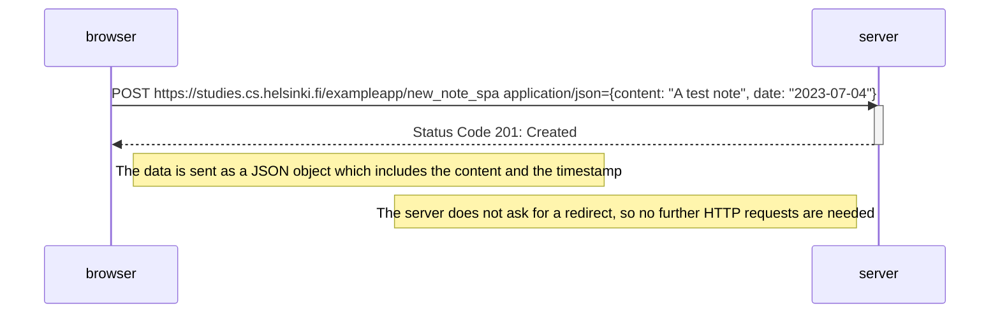

```mermaid
sequenceDiagram
    participant browser
    participant server

    browser->>server: POST https://studies.cs.helsinki.fi/exampleapp/new_note_spa application/json={content: "A test note", date: "2023-07-04"}
    activate server
    server-->>browser: Status Code 201: Created
    deactivate server
    
    Note right of browser: The data is sent as a JSON object which includes the content and the timestamp
    
    Note left of server: The server does not ask for a redirect, so no further HTTP requests are needed
```